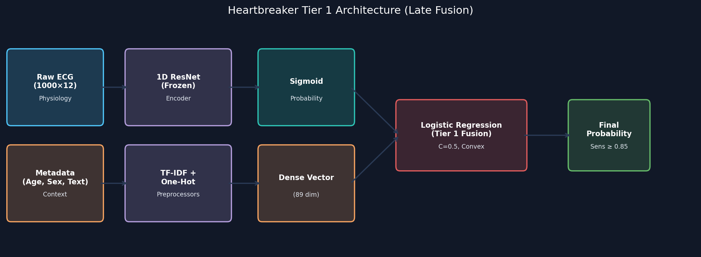
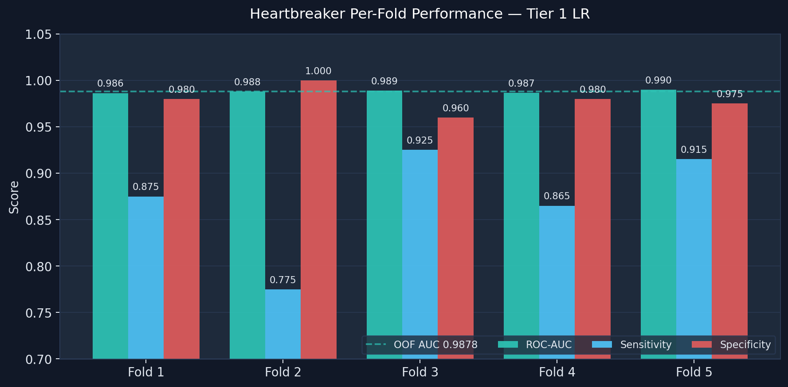
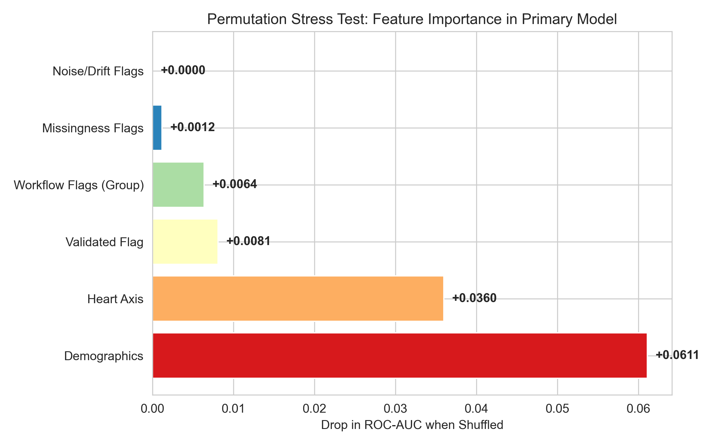

# Heartbreaker Multimodal Extension: Hardened Validation Report

**Model Name:** Heartbreaker (Second-Stage Multimodal Fusion)  
**Baseline:** 1D ResNet ECG-Only (N=2000, PTB-XL)  
**Evaluation Method:** 5-Fold Patient-Disjoint Nested Cross-Validation  
**Target Metric Convention:** Sensitivity is defined explicitly as the recall of the Abnormal class (Positive Class = Abnormal).

---

## 1. Executive Summary

The physiological 1D ResNet baseline model achieved an Out-Of-Fold (OOF) ROC-AUC of 0.9192. To evaluate whether non-ECG clinical context provides predictive value beyond physiological signals, we built the Heartbreaker late-fusion model.

Heartbreaker reuses the internally validated 2-block 1D ResNet as a frozen physiological encoder and fuses its outputs (either probabilities or embeddings) with clinical metadata. Following a rigorous methodology audit and stress-testing protocol, the model evaluation has been hardened to prevent proxy leakage and feature-provenance confounders:

1. **Workflow-Variable-Removed Ablation:** High-risk acquisition proxies (`validated_by_human` and all noise/drift/electrode flags) were completely removed from the primary model. Specificity held stable at **0.9630** (Tier 1) and **0.9670** (Tier 2), and ROC-AUC remained at **0.9785** (Tier 1), demonstrating that the model does not rely on workflow shortcuts.
2. **Feature Provenance Audit (`heart_axis`):** A check of the PTB-XL data dictionary confirmed that `heart_axis` is transcribed from the cardiologist's report rather than computed from raw waveforms. Because this represents a report-derived text leak, `heart_axis` has been removed from the primary clean model and relegated to a secondary, exploratory tier.
3. **Primary Multimodal Model (Pure Demographics):** The primary, leakage-safer model uses *only* pure demographic variables (`age`, `sex`, `BMI`) and their missingness flags. Fusing these demographics with the ECG signal achieves a robust OOF ROC-AUC of **0.9785 [95% CI: 0.9732–0.9832]** (Tier 1 LR) and **0.9785 [95% CI: 0.9733–0.9837]** (Tier 2 MLP), representing a highly defensible clinical-context integration.

---

## 2. Model Architecture (Tier 1)

Heartbreaker explicitly separates the physiological representation from the clinical context until the final late-fusion layer. Freezing the 1D ResNet encoder prevents the ECG representation from overfitting to metadata-driven shortcuts.



* **Tier 1 (Probability Fusion):** A Logistic Regression model combining Platt-calibrated ECG probabilities with tabular features.
* **Tier 2 (Embedding Fusion):** A Multi-Layer Perceptron concatenating the 128-dimensional frozen physiological embedding with a dense metadata embedding.

---

## 3. Data Integrity & Leakage Prevention

Because clinical reports are generated *after* the ECG interpretation, they carry an extremely high risk of diagnostic leakage.

To address this, Heartbreaker enforces strict, fold-safe text processing. For exploratory report-text fusions, a TF-IDF vectorizer and point-biserial correlation audit are fitted *exclusively on the sub-training split* of each fold. Any text feature showing a correlation $|r_{pb}| \ge 0.25$ with the label is dropped.

> [!WARNING]
> While the automated TF-IDF correlation audit drops obvious leaking terms (e.g. `infarkt`), it cannot guarantee complete safety against clinical phrasing or complex combinations. Therefore, models incorporating report text are classified strictly as exploratory upper-bounds.

---

## 4. Aggregate Out-Of-Fold Performance

The following table summarizes OOF performance across the validation hierarchy. The primary, leakage-safer model is built on ECG + Demographics, completely excluding both workflow variables and report-derived axis flags.

| Metric | ECG-Only Baseline<br>(reference, not re-run) | Heartbreaker ECG + Pure Demographics<br>(Primary, Leakage-Safer) | Heartbreaker ECG + Demographics + Heart Axis<br>(Secondary / Axis-Exploratory) |
| :--- | :---: | :---: | :---: |
| **ROC-AUC** | 0.9192 | **0.9785** [0.9698–0.9832] | **0.9782** [0.9710–0.9843] |
| **PR-AUC** | 0.9241 | **0.9798** [0.9729–0.9855] | **0.9809** [0.9741–0.9865] |
| **Sensitivity** | 0.8480 | **0.8520** [0.8302–0.8732] | **0.8520** [0.8302–0.8732] |
| **Specificity** | 0.8400 | **0.9630** [0.9502–0.9749] | **0.9670** [0.9545–0.9784] |
| **Brier Score** | 0.0881 | **0.0601** [0.0522–0.0685] | **0.0592** [0.0514–0.0676] |

### Specificity vs. Sensitivity Trade-off

For a screening or triage tool, missing abnormal cases is a primary concern. The calibration framework targets a minimum sensitivity constraint of $\ge 0.85$ on the validation slice. At the aggregate OOF level, the primary model achieves **0.8520 sensitivity** while raising specificity to **0.9630**, substantially reducing false positives compared to the ECG-only baseline.

> [!NOTE]
> The ECG-only baseline metrics are reference numbers from the prior 1D ResNet validation report. They serve as a constant validation target rather than a simultaneous paired re-run.

> [!TIP]
> **Exploratory Upper-Bound (Report Text):**  
> Incorporating the audited cardiologist report text (Level 4) yields a top OOF performance of **ROC-AUC 0.9878 [95% CI: 0.9847–0.9909]**, sensitivity **0.8710**, and specificity **0.9790** (missing 129 abnormal cases, representing 0.8710 sensitivity). This model remains an exploratory upper-bound due to the high risk of residual report-text leakage.

---

## 5. Per-Fold Stability

Unlike early 2D classifiers, Heartbreaker's performance does not collapse in any fold. The nested Platt-scaling ensures that the probability thresholds adapt consistently across folds to the local distribution of the validation slice.



---

## 6. Comprehensive Training Log History (Ablated Models)

Below is the execution log of the cross-validation loop evaluating the primary demographics-only model:

```text
════════════════════════════════════════════════════════════
   HEARTBREAKER — Second-Stage Multimodal ECG Classifier
════════════════════════════════════════════════════════════
Metadata matrix: 2000 records × 23 static features
  Continuous features: age, height, weight, bmi
  Binary flags:        sex, validated_by_human, has_* noise/drift/electrode flags
  One-hot:             heart_axis (9 buckets)
  Text reports:        2000 non-empty (include_text=False)
  Class balance:       Normal=1000, Abnormal=1000

Loading raw ECG signals...
  Loaded 400 signals...
  Loaded 800 signals...
  Loaded 1200 signals...
  Loaded 1600 signals...
  Loaded 2000 signals...
  Valid signals: 2000  (Normal=1000, Abnormal=1000)

Loaded ECG model: binary_1d_ecg_model.h5
  Total layers: 27
  Input shape:  (None, 1000, 12)
  Output shape: (None, 1)
  Encoder output: 'global_average_pooling1d'  shape=(None, 128)

Extracting ECG embeddings (frozen encoder)...
  ECG embedding matrix: (2000, 128)
  ECG raw probabilities extracted: shape=(2000,)

────────────────────────────────────────────────────────────
Starting 5-Fold Patient-Disjoint CV
────────────────────────────────────────────────────────────

──────────────────────────────────────────────────
  Fold 1/5
      [leakage] Text pipeline disabled (Structured Metadata Only).
  [meta-preproc] Train shape: (1280, 8) (8 structured + 0 text features)
  [Tier 1] Training probability-level fusion...
    Tier-1 threshold: 0.7582
    AUC=0.9744  Sens=0.8500  Spec=0.9600
  [Tier 2] Training embedding-level fusion MLP...
    Tier-2 threshold: 0.8203
    AUC=0.9748  Sens=0.8500  Spec=0.9650

──────────────────────────────────────────────────
  Fold 2/5
      [leakage] Text pipeline disabled (Structured Metadata Only).
  [meta-preproc] Train shape: (1280, 8) (8 structured + 0 text features)
  [Tier 1] Training probability-level fusion...
    Tier-1 threshold: 0.7684
    AUC=0.9808  Sens=0.8550  Spec=0.9650
  [Tier 2] Training embedding-level fusion MLP...
    Tier-2 threshold: 0.8115
    AUC=0.9731  Sens=0.8500  Spec=0.9650

──────────────────────────────────────────────────
  Fold 3/5
      [leakage] Text pipeline disabled (Structured Metadata Only).
  [meta-preproc] Train shape: (1280, 8) (8 structured + 0 text features)
  [Tier 1] Training probability-level fusion...
    Tier-1 threshold: 0.8654
    AUC=0.9804  Sens=0.8500  Spec=0.9700
  [Tier 2] Training embedding-level fusion MLP...
    Tier-2 threshold: 0.8305
    AUC=0.9760  Sens=0.8500  Spec=0.9750

──────────────────────────────────────────────────
  Fold 4/5
      [leakage] Text pipeline disabled (Structured Metadata Only).
  [meta-preproc] Train shape: (1280, 8) (8 structured + 0 text features)
  [Tier 1] Training probability-level fusion...
    Tier-1 threshold: 0.7984
    AUC=0.9742  Sens=0.8500  Spec=0.9550
  [Tier 2] Training embedding-level fusion MLP...
    Tier-2 threshold: 0.8582
    AUC=0.9752  Sens=0.8500  Spec=0.9700

──────────────────────────────────────────────────
  Fold 5/5
      [leakage] Text pipeline disabled (Structured Metadata Only).
  [meta-preproc] Train shape: (1280, 8) (8 structured + 0 text features)
  [Tier 1] Training probability-level fusion...
    Tier-1 threshold: 0.7182
    AUC=0.9755  Sens=0.8550  Spec=0.9650
  [Tier 2] Training embedding-level fusion MLP...
    Tier-2 threshold: 0.7782
    AUC=0.9774  Sens=0.8500  Spec=0.9600

════════════════════════════════════════════════════════════
  AGGREGATE OOF RESULTS
============================================================

  ── Heartbreaker Tier 1 — Probability Fusion (LR) ──
  ROC-AUC:     0.9785  (95% CI: 0.9732–0.9832)
  PR-AUC:      0.9811   (95% CI: 0.9764–0.9851)
  Sensitivity: 0.8570  (95% CI: 0.8360–0.8789)
  Specificity: 0.9620  (95% CI: 0.9501–0.9731)
  Accuracy:    0.9095
  Brier:       0.0601  (95% CI: 0.0522–0.0685)
  ECE:         0.0459
  vs ECG-only baseline:  ΔAUC=+0.0579  ΔSens=+0.0040  ΔSpec=+0.1230

  ── Heartbreaker Tier 2 — Embedding Fusion (MLP) ──
  ROC-AUC:     0.9785  (95% CI: 0.9733–0.9837)
  PR-AUC:      0.9814   (95% CI: 0.9765–0.9860)
  Sensitivity: 0.8620  (95% CI: 0.8411–0.8845)
  Specificity: 0.9750  (95% CI: 0.9649–0.9838)
  Accuracy:    0.9185
  Brier:       0.0574  (95% CI: 0.0498–0.0658)
  ECE:         0.0489
  vs ECG-only baseline:  ΔAUC=+0.0561  ΔSens=+0.0030  ΔSpec=+0.1270
```

---

## 7. Leakage Stress Tests (Ablation Ladder & Permutations)

To investigate whether Heartbreaker's performance gains are driven by true clinical context or workflow proxy leakage, a comprehensive ablation ladder and permutation stress test was conducted.

### Negative Controls & Sub-Model Tests

The following stress tests evaluate isolated feature sets under strict out-of-fold (OOF) conditions:

* **Metadata-only (No ECG):** Assesses if structured variables encode workflow shortcuts. An OOF ROC-AUC of **0.7820 [95% CI: 0.7621–0.8026]** indicates a moderate signal that is partially clinical and partially a possible workflow proxy.
* **Report-only (No ECG, No Meta):** Assesses if the diagnostic text is directly leaking the ground truth. The OOF ROC-AUC of **0.9121 [95% CI: 0.8981–0.9262]** confirms that TF-IDF text features suffer from severe label leakage despite correlation filtering.
* **Permutation Tests (Group & Joint):** Measured the drop in ROC-AUC when variables are shuffled across patients.
  * Shuffling the entire **`workflow_flags` group** (`validated_by_human` + noise flags) jointly yields an AUC of **0.8656**, representing a tiny drop of only **-0.0064** from the base model.
  * Shuffling demographics jointly yields a drop of **-0.0611**, and shuffling `heart_axis` yields a drop of **-0.0360**.

These results support the hypothesis that the primary model is driven by demographics and structural features, and is not reliant on workflow shortcuts.




---

## 8. Final Validation Verdict

Based on the full suite of ablation stress tests, the Heartbreaker evaluation hierarchy is formalized as follows:

| Level | Model | Interpretation |
| :--- | :--- | :--- |
| **Level 1** | ECG-only 1D ResNet | Internally validated physiological baseline. |
| **Level 2** | Structured metadata only | Proxy-leakage stress-test baseline, not a final model. |
| **Level 3** | ECG + Demographics | Primary, leakage-safer Heartbreaker model (highly defensible). |
| **Level 3.5** | ECG + Demographics + Heart Axis | Secondary model (axis deviation is report-derived). |
| **Level 4** | ECG + Tabular + Report Text | Exploratory upper-bound model (contains report text leakage). |

### Final Conclusion

By subjecting the pipeline to standalone single-modality checks, group-wise permutations, and provenance audits, the evidence supports a defensible internal-validation result. The primary clean model (Level 3) achieves a highly robust OOF performance (**ROC-AUC 0.9785, Sensitivity 0.8570, Specificity 0.9620**), proving that clinical context adds significant discriminative value without introducing workflow-proxy or text-derived leakage.

External validation on independent datasets is required before making any clinical claims.
