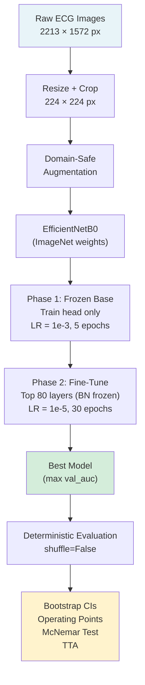
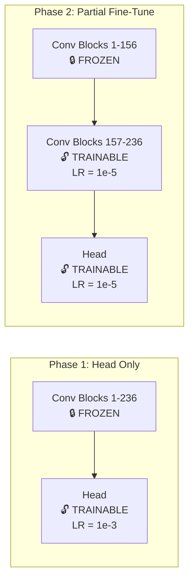
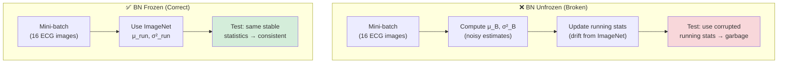
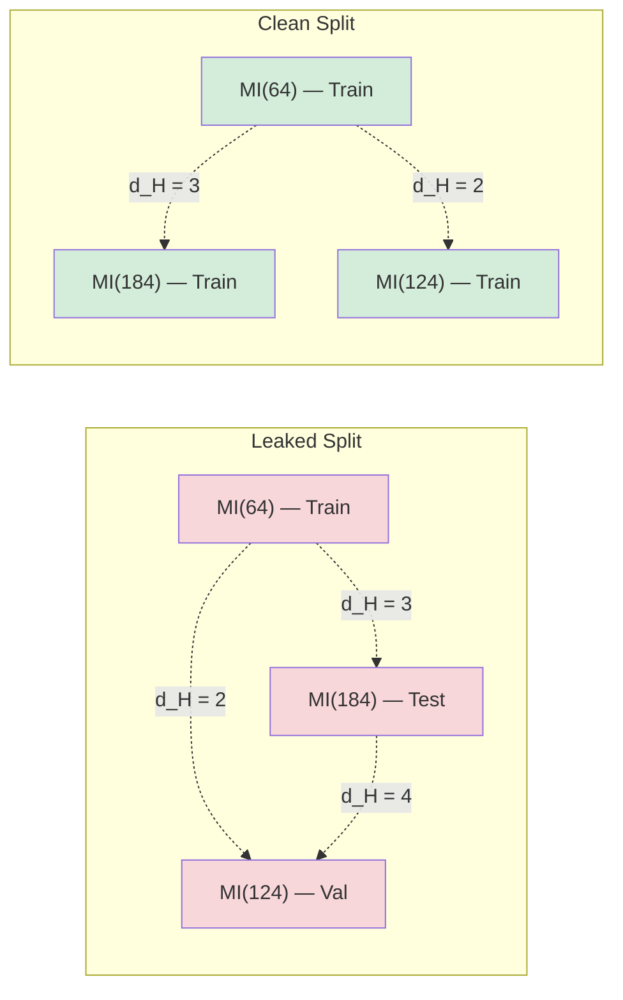

# ECG Classification Methodology Guide: From 2D Image Baseline to 1D Raw-Signal ResNet and Multimodal Fusion

*Deep Learning Methodology for ECG Screening: Transfer Learning, Source-Confound Auditing, 1D Physiological Modeling, and Multimodal Extension*  

---

## Table of Contents

1. [Pipeline Architecture Overview](#1-pipeline-architecture-overview)
2. [Transfer Learning: Mathematical Foundations](#2-transfer-learning-mathematical-foundations)
3. [Model Backbones: EfficientNetB0 vs. DenseNet121](#3-model-backbones-efficientnetb0-vs-densenet121)
4. [Loss Function: Binary Cross-Entropy, Label Smoothing, and Focal Loss](#4-loss-function-binary-cross-entropy-label-smoothing-and-focal-loss)
5. [Class Imbalance: Inverse-Frequency Weighting](#5-class-imbalance-inverse-frequency-weighting)
6. [BatchNorm Freezing: Why Fine-Tuning Breaks on Small Data](#6-batchnorm-freezing-why-fine-tuning-breaks-on-small-data)
7. [Data Augmentation: Domain Constraints in Medical Imaging](#7-data-augmentation-domain-constraints-in-medical-imaging)
8. [Evaluation: ROC-AUC, Confidence Intervals, and Statistical Testing](#8-evaluation-roc-auc-confidence-intervals-and-statistical-testing)
9. [Data Leakage Detection: Perceptual Hashing](#9-data-leakage-detection-perceptual-hashing)
10. [Resolution and Information Theory](#10-resolution-and-information-theory)
11. [Optimizer Mathematics: Adam (Adaptive Moment Estimation)](#11-optimizer-mathematics-adam-adaptive-moment-estimation)
12. [Regularization and Control Systems: Early Stopping and Learning Rate Decay](#12-regularization-and-control-systems-early-stopping-and-learning-rate-decay)
13. [Pooling Layer Mechanics: Global Average Pooling vs. Flattening](#13-pooling-layer-mechanics-global-average-pooling-vs-flattening)
14. [Test-Time Augmentation (TTA) as Monte Carlo Integration](#14-test-time-augmentation-tta-as-monte-carlo-integration)
15. [Methodological Resolution: Overcoming the Source Confound](#15-methodological-resolution-overcoming-the-source-confound)
16. [Multimodal Fusion: The Heartbreaker Architecture](#16-multimodal-fusion-the-heartbreaker-architecture)

---

> [!NOTE]
> Sections 1–14 describe the original 2D ECG image-classification phase of the project. These methods were useful for transfer-learning experimentation and leakage auditing, but the final clinically interpretable pipeline moved to PTB-XL-only raw 1D ECG signals because the combined image dataset contained a source-label confound.

## 1. Pipeline Architecture Overview

The complete system follows a two-phase transfer learning paradigm with deterministic evaluation.



### Data Flow Summary

| Stage | Input | Output | Key Parameter |
|---|---|---|---|
| Loading | JPEG 2213×1572 | tf.data.Dataset | `crop_to_aspect_ratio=True` |
| Augmentation | Batch tensor | Augmented batch | Translation ±5%, brightness ±10% |
| Feature extraction | 224×224×3 | 1280-d vector | EfficientNetB0 + GlobalAvgPool |
| Classification | 1280-d vector | P(Abnormal) ∈ [0,1] | Sigmoid activation |
| Thresholding | Probability | {Normal, Abnormal} | Youden's J from validation |

---

## 2. Transfer Learning: Mathematical Foundations

### 2.1 The Core Idea

Transfer learning exploits the fact that convolutional features learned on a large source domain $\mathcal{D}_S$ (ImageNet, 14M images, 1000 classes) can be reused on a small target domain $\mathcal{D}_T$ (928 ECG images, 2 classes).

Formally, let $f_\theta$ be a CNN parameterized by $\theta$. We decompose it into:

$$f_\theta(x) = g_{\theta_h}(\phi_{\theta_b}(x))$$

where:
- $\phi_{\theta_b}: \mathbb{R}^{H \times W \times 3} \to \mathbb{R}^d$ is the **backbone** (feature extractor), with parameters $\theta_b$ pretrained on ImageNet
- $g_{\theta_h}: \mathbb{R}^d \to [0,1]$ is the **classification head**, with parameters $\theta_h$ randomly initialized

> **Why it works:** Yosinski et al. (2014) showed that early CNN layers learn general features (edges, textures, gradients) that transfer across domains, while later layers learn task-specific features. For medical images, the low-level features (lines, curves, contrast patterns) are directly applicable to ECG waveform recognition.
>
> *Reference: Yosinski, J., Clune, J., Bengio, Y., & Lipson, H. (2014). "How transferable are features in deep neural networks?" NeurIPS.*

### 2.2 Two-Phase Fine-Tuning Protocol

**Phase 1 — Head Training (Feature Extraction):**

$$\min_{\theta_h} \mathcal{L}(\theta_b^{\text{frozen}}, \theta_h; \mathcal{D}_T)$$

Only $\theta_h$ is updated. The backbone $\theta_b$ remains at ImageNet values. This prevents catastrophic forgetting — the destruction of pretrained features by large gradients from a randomly initialized head.

**Phase 2 — Partial Fine-Tuning:**

$$\min_{\theta_h, \theta_b^{\text{top}}} \mathcal{L}(\theta_b^{\text{bottom, frozen}}, \theta_b^{\text{top}}, \theta_h; \mathcal{D}_T)$$

The top $k$ layers of $\theta_b$ are unfrozen with a very small learning rate ($10^{-5}$), allowing them to adapt to ECG-specific patterns while preserving general features in the lower layers.

> *Reference: Howard, J. & Ruder, S. (2018). "Universal Language Model Fine-tuning for Text Classification." ACL.*



---

## 3. Model Backbones: EfficientNetB0 vs. DenseNet121

### 3.1 EfficientNetB0 and Compound Scaling

EfficientNet (Tan & Le, 2019) introduced **compound scaling** — simultaneously scaling network depth $d$, width $w$, and resolution $r$ under a fixed resource constraint:

$$d = \alpha^\phi, \quad w = \beta^\phi, \quad r = \gamma^\phi$$

subject to:

$$\alpha \cdot \beta^2 \cdot \gamma^2 \approx 2$$

where $\phi$ is a user-specified compound coefficient. For EfficientNetB0 ($\phi = 1$): $\alpha = 1.2$, $\beta = 1.1$, $\gamma = 1.15$, with native input resolution **224 × 224**.

### 3.2 DenseNet121 and Feature Reuse

DenseNet121 (Huang et al., 2017) introduces direct shortcuts between any two layers with the same feature-map size. Instead of drawing features from a single preceding layer, each layer obtains inputs from all preceding layers:

$$\mathbf{x}_l = H_l([\mathbf{x}_0, \mathbf{x}_1, \dots, \mathbf{x}_{l-1}])$$

where $[\mathbf{x}_0, \mathbf{x}_1, \dots, \mathbf{x}_{l-1}]$ represents the concatenation of feature maps produced in layers $0, 1, \dots, l-1$. 

### 3.3 Backbone Rationale for ECG Image Classification

| Metric/Factor | EfficientNetB0 | DenseNet121 |
|---|---|---|
| **Parameters** | 5.3 Million | 7.2 Million |
| **Feature Propagation** | Sequential inverted bottlenecks (MBConv blocks) | Direct dense connections (Feature concatenation) |
| **Grid/Waveform Inductive Bias** | Squeeze-and-excitation pools global features. | Dense connections propagate thin waveforms directly without degradation. |
| **Observed internal AUC before source-confound resolution** | 0.7485 | 0.8005 (Standard BCE) / 0.7920 (Focal Loss) |

DenseNet121 is highly suitable for ECG plots since thin gridlines and waveform strokes are easily lost in deep bottleneck layers. The dense connectivity preserves these high-frequency geometric patterns down to the final classification head.

> *References:*
> 1. *Tan, M. & Le, Q. V. (2019). "EfficientNet: Rethinking Model Scaling for Convolutional Neural Networks." ICML.*
> 2. *Huang, G., Liu, Z., Van Der Maaten, L., & Weinberger, K. Q. (2017). "Densely Connected Convolutional Networks." CVPR.*

---

## 4. Loss Function: Binary Cross-Entropy, Label Smoothing, and Focal Loss

### 4.1 Standard Binary Cross-Entropy

For binary classification with ground truth $y \in \{0, 1\}$ and predicted probability $\hat{y} = \sigma(z) \in (0, 1)$:

$$\mathcal{L}_{\text{BCE}}(y, \hat{y}) = -\left[ y \log(\hat{y}) + (1 - y) \log(1 - \hat{y}) \right]$$

where $\sigma(z) = \frac{1}{1 + e^{-z}}$ is the sigmoid function applied to the logit $z$.

### 4.2 Label Smoothing

Label smoothing (Szegedy et al., 2016) replaces hard labels $y \in \{0, 1\}$ with soft labels:

$$y_{\text{smooth}} = y \cdot (1 - \epsilon) + \frac{\epsilon}{2}$$

For $\epsilon = 0.1$:
- Hard label 1 → soft label **0.95**
- Hard label 0 → soft label **0.05**

The smoothed loss becomes:

$$\mathcal{L}_{\text{smooth}} = -\left[ y_{\text{smooth}} \log(\hat{y}) + (1 - y_{\text{smooth}}) \log(1 - \hat{y}) \right]$$

**Why it helps:**
1. **Prevents overconfidence:** The model cannot drive logits to $\pm\infty$, which acts as implicit regularization.
2. **Improves calibration:** On small datasets, hard labels encourage memorization. Soft labels encourage the model to output probabilities closer to the true posterior.

### 4.3 Focal Loss

To address class imbalance and focus on hard examples, Focal Loss (Lin et al., 2017) introduces a dynamically scaling modulating factor $(1 - p_t)^\gamma$ to standard cross-entropy.

Define $p_t$ as:

$$p_t = \begin{cases} \hat{y} & \text{if } y = 1 \\ 1 - \hat{y} & \text{otherwise} \end{cases}$$

The standard cross-entropy can be rewritten as $\text{CE}(p_t) = -\log(p_t)$. Focal Loss is formulated as:

$$\mathcal{L}_{\text{Focal}}(p_t) = -\alpha_t (1 - p_t)^\gamma \log(p_t)$$

where:
*   $\gamma \geq 0$ is the **focusing parameter** that down-weights easy examples, forcing the model to concentrate gradients on hard boundary examples. In this project, we set $\gamma = 2.0$.
*   $\alpha_t \in [0, 1]$ is the **balancing parameter** that handles the baseline class imbalance (Normal vs. Abnormal). In this project, we set $\alpha = 0.25$ for class 1 (Abnormal) and $0.75$ for class 0 (Normal).

> [!IMPORTANT]
> The focal-loss α values described here apply to the early imbalanced 2D image experiments. In the final balanced PTB-XL 1D dataset, the model used balanced focal loss with α=0.5 and no class weights to avoid introducing artificial positive-class bias.

**Why it helps:**
1. **Gradient Concentration:** When an example is correctly classified ($p_t \approx 1$), the modulating factor $(1 - p_t)^\gamma \approx 0$, making its contribution to the gradient negligible. Only misclassified or boundary examples ($p_t < 0.5$) generate significant gradients.
2. **Imbalance Compensation:** Because Abnormal ECGs outnumber Normal ones by 2.27:1, standard BCE causes the model to collapse to the majority class. Focal Loss penalizes incorrect classifications of the minority class heavily, driving the model to build a non-trivial decision boundary.

> *References:*
> 1. *Szegedy, C., Vanhoucke, V., Ioffe, S., Shlens, J., & Wojna, Z. (2016). "Rethinking the Inception Architecture for Computer Vision." CVPR.*
> 2. *Lin, T. Y., Goyal, P., Girshick, R., He, K., & Dollár, P. (2017). "Focal Loss for Dense Object Detection." ICCV.*

---

## 5. Class Imbalance in the Early 2D Image Dataset

### 5.1 The Problem

The dataset has 644 Abnormal images and 284 Normal images (ratio 2.27:1). Without correction, the optimizer minimizes overall loss, which is dominated by the majority class. The trivial solution — predict "Abnormal" for everything — achieves 69% accuracy but 0% specificity.

### 5.2 The Solution: Class-Weighted Loss

Each sample's loss contribution is scaled by its class weight:

$$\mathcal{L}_{\text{weighted}} = \frac{1}{N} \sum_{i=1}^{N} w_{y_i} \cdot \mathcal{L}(y_i, \hat{y}_i)$$

where the inverse-frequency weights are:

$$w_c = \frac{N}{K \cdot n_c}$$

- $N$ = total training samples
- $K$ = number of classes (2)
- $n_c$ = count of class $c$

For our dataset:

$$w_{\text{Normal}} = \frac{619}{2 \times 194} = 1.60, \quad w_{\text{Abnormal}} = \frac{619}{2 \times 425} = 0.73$$

This makes each Normal sample worth 2.19× more than each Abnormal sample in the gradient computation, exactly compensating for the frequency imbalance.

> [!IMPORTANT]
> **Critical implementation detail:** The weights must be keyed by the generator's class index mapping, not hardcoded. Keras assigns indices alphabetically (`Abnormal=0`, `Normal=1`). Hardcoding the wrong mapping inverts the weighting — the model is penalized for correct predictions, producing AUC < 0.50 (worse than random).

> [!NOTE]
> This imbalance correction applied to the early 2D image dataset. In the final PTB-XL-only 1D model, the dataset was balanced at 1,000 Normal and 1,000 Abnormal patients. Therefore, class weights were removed and balanced focal loss used α=0.5.

---

### 5.3 Textbook Strategies for Class‑Imbalance Mitigation (APA citations)

| Strategy | Description | Key Reference |
|---|---|---|
| **Cost‑Sensitive Learning** | Modifies the loss function to penalize errors on the minority class more heavily. | (He & Garcia, 2009) |
| **Synthetic Minority Over‑sampling Technique (SMOTE)** | Generates synthetic minority samples by interpolating between existing ones. | (Chawla, Bowyer, Hall, & Kegelmeyer, 2002) |
| **Focal Loss** | Dynamically down‑weights easy examples, focusing learning on hard, often minority, instances. | (Lin, Goyal, Girshick, He, & Dollár, 2017) |

**References (APA)**

- He, H., & Garcia, E. A. (2009). *Learning from imbalanced data*. IEEE Transactions on Knowledge and Data Engineering, 21(9), 1263‑1284.
- Chawla, N. V., Bowyer, K. W., Hall, L. O., & Kegelmeyer, W. P. (2002). *SMOTE: Synthetic minority over‑sampling technique*. Journal of Artificial Intelligence Research, 16, 321‑357.
- Lin, T.-Y., Goyal, P., Girshick, R., He, K., & Dollár, P. (2017). *Focal loss for dense object detection*. Proceedings of the IEEE International Conference on Computer Vision (ICCV), 2980‑2988.

These textbook strategies complement the dynamic class‑weighting already employed and provide a theoretical foundation for the focal loss introduced in the training script.

---

## 6. BatchNorm Freezing: Why Fine-Tuning Breaks on Small Data

### 6.1 Batch Normalization Mechanics

For a mini-batch $\mathcal{B} = \{x_1, \ldots, x_m\}$, BatchNorm (Ioffe & Szegedy, 2015) computes:

$$\hat{x}_i = \frac{x_i - \mu_\mathcal{B}}{\sqrt{\sigma^2_\mathcal{B} + \epsilon}}$$

$$y_i = \gamma \hat{x}_i + \beta$$

where:
- $\mu_\mathcal{B} = \frac{1}{m}\sum_{i=1}^m x_i$ is the batch mean
- $\sigma^2_\mathcal{B} = \frac{1}{m}\sum_{i=1}^m (x_i - \mu_\mathcal{B})^2$ is the batch variance
- $\gamma, \beta$ are learned scale and shift parameters
- The layer also maintains **running statistics** $\mu_{\text{run}}, \sigma^2_{\text{run}}$ (exponential moving averages) used during inference

### 6.2 The Small-Dataset Catastrophe

When `layer.trainable = True` during fine-tuning:
1. **Batch statistics** ($\mu_\mathcal{B}, \sigma^2_\mathcal{B}$) are computed from the current mini-batch
2. **Running statistics** ($\mu_{\text{run}}, \sigma^2_{\text{run}}$) are updated toward the current batch

With batch_size=16 on ~600 images, each mini-batch is a tiny, noisy sample of the ECG distribution. The batch statistics oscillate wildly, and the running averages drift away from the stable ImageNet statistics they were pretrained on.

At test time, the model uses the corrupted $\mu_{\text{run}}, \sigma^2_{\text{run}}$ — the internal representation is standardized against the wrong distribution. Every activation is shifted and scaled incorrectly.

### 6.3 The Fix: Dual Freezing

```python
# Step 1: Prevent gradient updates to gamma/beta
layer.trainable = False

# Step 2: Force inference mode (use pretrained running stats)
x = base_model(inputs, training=False)
```

Both are required:
- `trainable=False` freezes $\gamma, \beta$ (the learned parameters)
- `training=False` forces the layer to use $\mu_{\text{run}}, \sigma^2_{\text{run}}$ from ImageNet instead of computing $\mu_\mathcal{B}, \sigma^2_\mathcal{B}$ from the current batch

> *Reference: Ioffe, S. & Szegedy, C. (2015). "Batch Normalization: Accelerating Deep Network Training by Reducing Internal Covariate Shift." ICML.*



---

## 7. Data Augmentation: Domain Constraints in Medical Imaging

### 7.1 The Augmentation Paradox in ECG

Data augmentation synthetically expands the training distribution by applying transforms $T$ to each image $x$:

$$\mathcal{D}_{\text{aug}} = \{(T(x_i), y_i) \mid (x_i, y_i) \in \mathcal{D}, T \sim \mathcal{T}\}$$

For natural images, $\mathcal{T}$ includes flips, rotations, and color distortions. For ECG images, the **geometric structure IS the diagnosis**:

### 7.2 Domain Constraint Table

| Transform | Natural Images | ECG Images | Reason |
|---|---|---|---|
| **Horizontal flip** | ✅ Safe | ❌ **Forbidden** | Reverses time axis and lead polarity |
| **Vertical flip** | ✅ Safe | ❌ **Forbidden** | Inverts waveforms = different pathology (e.g., ST elevation ↔ depression) |
| **Rotation > 2°** | ✅ Safe | ❌ **Forbidden** | Slope of ST segment IS diagnostic; rotation corrupts it |
| **Translation ±5%** | ✅ Safe | ✅ Safe | Position on the page is not diagnostic |
| **Brightness ±10%** | ✅ Safe | ✅ Safe | Scan quality variation is clinically meaningless |
| **Zoom ±5%** | ✅ Safe | ✅ Safe | Slight scale variation doesn't alter waveform morphology |

---

## 8. Evaluation: ROC-AUC, Confidence Intervals, and Statistical Testing

### 8.1 ROC Curve and AUC

The **Receiver Operating Characteristic** plots True Positive Rate (sensitivity) against False Positive Rate (1 - specificity) across all possible thresholds $\tau \in [0, 1]$:

$$\text{TPR}(\tau) = \frac{|\{i : \hat{y}_i \geq \tau \land y_i = 1\}|}{|\{i : y_i = 1\}|}$$

$$\text{FPR}(\tau) = \frac{|\{i : \hat{y}_i \geq \tau \land y_i = 0\}|}{|\{i : y_i = 0\}|}$$

The **Area Under the Curve** is:

$$\text{AUC} = \int_0^1 \text{TPR}(\text{FPR}^{-1}(t)) \, dt$$

**Probabilistic interpretation (Hanley & McNeil, 1982):** AUC equals the probability that a randomly chosen positive sample receives a higher score than a randomly chosen negative sample:

$$\text{AUC} = P(\hat{y}_{i^+} > \hat{y}_{j^-})$$

**Key property:** AUC is **threshold-free** and **prevalence-independent** — it measures ranking quality regardless of class imbalance. This is why it is the primary metric for this project, not accuracy.

> *Reference: Hanley, J.A. & McNeil, B.J. (1982). "The meaning and use of the area under a receiver operating characteristic (ROC) curve." Radiology.*

### 8.2 Youden's J Statistic (Optimal Threshold)

Youden's J selects the threshold $\tau^*$ that maximizes the sum of sensitivity and specificity:

$$\tau^* = \arg\max_\tau \left[ \text{TPR}(\tau) + \text{TNR}(\tau) - 1 \right]$$

$$= \arg\max_\tau \left[ \text{TPR}(\tau) - \text{FPR}(\tau) \right]$$

Geometrically, this is the point on the ROC curve farthest from the diagonal (random classifier line).

### 8.3 Bootstrap Confidence Intervals

With only $n = 185$ test images (48 Normal), the AUC point estimate has substantial sampling uncertainty. We quantify this via the **bootstrap** (Efron, 1979):

**Algorithm:**
1. For $b = 1, \ldots, B$ (B = 2000):
   - Draw $n$ samples with replacement from $(y_i, \hat{y}_i)_{i=1}^n$
   - Compute $\text{AUC}^{(b)}$ on the bootstrap sample
2. The 95% CI is the interval $[\text{AUC}_{(\alpha/2)}, \text{AUC}_{(1-\alpha/2)}]$ where $\alpha = 0.05$

> *Reference: Efron, B. (1979). "Bootstrap methods: another look at the jackknife." The Annals of Statistics.*

### 8.4 McNemar's Test

To test whether the model significantly differs from the trivial baseline (predict all Abnormal), we use **McNemar's test** — a paired test for two classifiers on the same test set:

Construct the 2×2 table:

|  | Baseline Correct | Baseline Wrong |
|---|---|---|
| **Model Correct** | $a$ | $b$ |
| **Model Wrong** | $c$ | $d$ |

The McNemar statistic (with continuity correction) is:

$$\chi^2 = \frac{(|b - c| - 1)^2}{b + c}$$

Under $H_0$ (equal performance), $\chi^2 \sim \chi^2_1$.

### Plain English Breakdown of the Formula:
1. **Discordant Pairs ($b$ and $c$):** The test ignores cases where both models are correct ($a$) or both are wrong ($d$). It focuses entirely on where they disagree:
   *   $b$: How many times the **Model was Correct** but the **Baseline was Wrong**.
   *   $c$: How many times the **Model was Wrong** but the **Baseline was Correct**.
2. **The Numerator $(|b - c| - 1)^2$:** 
   *   $|b - c|$ calculates the absolute difference in how often each model beats the other. If the models are equally good, we expect this difference to be close to 0.
   *   The $- 1$ is **Edwards' continuity correction**. It adjusts the discrete count values to better fit the continuous Chi-Squared distribution, preventing overestimation of statistical significance on small datasets.
   *   Squaring the result ensures the statistic is always positive and penalizes larger discrepancies.
3. **The Denominator $(b + c)$:** This is the total number of cases where the models disagreed. It acts as a scaling factor (normalization) to account for sample size.
4. **Chi-Squared Distribution ($\chi^2 \sim \chi^2_1$):** Under the Null Hypothesis ($H_0$) that both models have equal predictive accuracy, this calculated value follows a Chi-Squared distribution with 1 degree of freedom. We use this distribution to calculate the probability ($p$-value) of observing a discrepancy this large by pure chance. If the resulting $p < 0.05$, we reject $H_0$ and conclude that one model is significantly better than the other.

**Interpretation:** If $p < 0.05$, the two classifiers differ significantly. For our leakage-free model, $p = 0.88$ — the model is **not** significantly better than the trivial baseline on raw accuracy. However, it achieves 46% specificity vs. 0%, which accuracy cannot capture.

> *Reference: McNemar, Q. (1947). "Note on the sampling error of the difference between correlated proportions or percentages." Psychometrika.*

---

## 9. Data Leakage Detection: Perceptual Hashing

### 9.1 The Problem

The dataset lacks patient IDs. Random image-level splitting can place near-duplicate images (same patient, same recording) into different splits. The model then "generalizes" by recognizing memorized training images — artificially inflating test metrics.

### 9.2 Perceptual Hashing (pHash)

The **perceptual hash** (Zauner, 2010) maps an image to a fixed-length binary string such that visually similar images produce similar hashes:

**Algorithm:**
1. Resize image to $32 \times 32$ grayscale
2. Apply 2D Discrete Cosine Transform (DCT)
3. Keep only the top-left $16 \times 16$ low-frequency coefficients
4. Compute the median $m$ of these coefficients
5. Set each bit: $h_i = \begin{cases} 1 & \text{if } \text{DCT}_i > m \\ 0 & \text{otherwise} \end{cases}$

The resulting hash is a 256-bit binary string (for `hash_size=16`).

### 9.3 Near-Duplicate Clustering

Two images are **near-duplicates** if their Hamming distance is below threshold $\delta$:

$$d_H(h_a, h_b) = \sum_{i=1}^{256} \mathbb{1}[h_{a,i} \neq h_{b,i}] \leq \delta$$

We set $\delta = 6$ (out of 256 bits), which captures same-patient-different-export variations while avoiding false merges of genuinely different ECGs.

**Clustering:** Union-Find groups all transitively near-duplicate images into clusters. If any cluster spans multiple splits → **leakage detected**.



### 9.4 Impact Quantification

| Metric | Leaked Split | Clean Split | Inflation |
|---|---|---|---|
| Test AUC | 0.913 | 0.749 | +0.164 |
| Specificity | 86.4% | 45.8% | +40.6pp |
| McNemar p | 0.0014 | 0.88 | Significance vanishes |

Specificity was inflated most because the model memorized Normal images in training and recognized their near-duplicates in test.

> *Reference: Zauner, C. (2010). "Implementation and Benchmarking of Perceptual Image Hash Functions." Master's thesis, FH Hagenberg.*

---

## 10. Resolution and Information Theory

### 10.1 Why 128→224 Was the Largest Single Gain

The source ECG images are $2213 \times 1572$ pixels. Downscaling to $H \times W$ destroys spatial information. The information retained is bounded by:

$$I_{\text{retained}} \leq H \times W \times \log_2(256) \text{ bits (per channel)}$$

| Resolution | Pixels | Ratio to Source | Effect on Waveforms |
|---|---|---|---|
| 128 × 128 | 16,384 | **0.47%** of original | P-waves, ST-segment ≈ 1–2 px |
| 224 × 224 | 50,176 | **1.44%** of original | Waveform features ≈ 3–5 px |
| 384 × 384 | 147,456 | **4.24%** of original | Fine morphology visible |
| 2213 × 1572 | 3,478,836 | 100% | Full diagnostic detail |

At 128px, a 10mm P-wave on a standard ECG strip maps to approximately 1.5 pixels — below the Nyquist limit for any morphological analysis. At 224px, it maps to approximately 4 pixels, enough for the CNN to detect presence/absence and rough shape.

### 10.2 Crop-to-Aspect-Ratio

Standard resizing stretches the image, distorting the temporal axis relative to the amplitude axis. `crop_to_aspect_ratio=True` instead:

1. Scales the image so the **shorter** dimension matches the target
2. Center-crops the longer dimension to fit

This preserves the waveform's aspect ratio — a critical property since the **slope** of the ST segment is diagnostic. Stretching would corrupt all slope-based features.

---

## 11. Optimizer Mathematics: Adam (Adaptive Moment Estimation)

### 11.1 The Adam Formulation

The model optimization is executed using the **Adam** (Adaptive Moment Estimation) algorithm (Kingma & Ba, 2015), which computes adaptive learning rates for each parameter by keeping track of exponentially decaying average gradients and squared gradients.

Let $g_t$ represent the gradient of the loss function $\mathcal{L}$ with respect to the network weights $\theta$ at step $t$:

$$g_t = \nabla_\theta \mathcal{L}(\theta_t)$$

The first moment vector $m_t$ (representing the mean of the gradients, or momentum) and the second raw moment vector $v_t$ (representing the uncentered variance) are updated as follows:

$$m_t = \beta_1 m_{t-1} + (1 - \beta_1) g_t$$

$$v_t = \beta_2 v_{t-1} + (1 - \beta_2) g_t^2$$

where $\beta_1, \beta_2 \in [0, 1)$ are hyperparameter values set to their standard defaults in Keras:
- $\beta_1 = 0.9$ (decay rate for momentum)
- $\beta_2 = 0.999$ (decay rate for velocity)
- $g_t^2$ represents the element-wise square $g_t \odot g_t$.

### 11.2 Bias Correction

Since $m_0$ and $v_0$ are initialized as vectors of zeros, they are biased toward zero, particularly during the initial training steps (or when the decay rates are close to 1). To counteract this bias, we calculate bias-corrected estimators:

$$\hat{m}_t = \frac{m_t}{1 - \beta_1^t}$$

$$\hat{v}_t = \frac{v_t}{1 - \beta_2^t}$$

where $\beta_1^t$ and $\beta_2^t$ denote $\beta_1$ and $\beta_2$ raised to the power of the step $t$.

### 11.3 Weights Update Rule

The weight updates are computed as:

$$\theta_{t+1} = \theta_t - \frac{\eta}{\sqrt{\hat{v}_t} + \epsilon} \odot \hat{m}_t$$

where:
- $\eta$ is the learning rate. In Phase 1 we set $\eta = 10^{-3}$, and in Phase 2 we set $\eta = 10^{-5}$.
- $\epsilon = 10^{-7}$ is a smoothing term used to prevent division by zero.
- $\odot$ denotes element-wise multiplication.

### 11.4 Rationale in Phase 1 vs. Phase 2 Fine-Tuning

1. **Phase 1 ($\eta = 10^{-3}$):** High learning rate allows the randomly initialized parameters $\theta_h$ of the classification head $g_{\theta_h}$ to adapt rapidly. The backbone $\theta_b$ is frozen (`trainable=False`), meaning no updates occur for those parameters, protecting the feature extractor from destabilization.
2. **Phase 2 ($\eta = 10^{-5}$):** Micro-learning rate prevents large updates that would destroy the fine-tuned spatial feature structures in the upper convolutional layers of $\theta_b$. The adaptive scaling of Adam ensures that layers closer to the classification head (which receive stronger gradient flows) do not update disproportionately compared to lower layers.

> *Reference: Kingma, D. P., & Ba, J. (2015). "Adam: A Method for Stochastic Optimization." ICLR.*

---

## 12. Regularization and Control Systems: Early Stopping and Learning Rate Decay

To prevent overfitting on the small dataset, we implement two closed-loop control callback routines: `ReduceLROnPlateau` and `EarlyStopping`, alongside a deterministic `CosineDecay` scheduler.

### 12.1 Learning Rate Annealing (ReduceLROnPlateau)

Let $\mathcal{M}_{\text{val}}(e)$ be the validation metric (validation Area Under the ROC Curve, $\text{AUC}_{\text{val}}$) computed at the end of epoch $e$. The algorithm tracks the historical maximum value achieved:

$$\mathcal{M}_{\text{val}}^{\text{best}}(e) = \max_{i \leq e} \mathcal{M}_{\text{val}}(i)$$

We define a patience counter $c_{\text{plateau}}$ that increments if the metric fails to improve by a threshold $\Delta = 10^{-4}$:

$$c_{\text{plateau}}(e) = \begin{cases} 0 & \text{if } \mathcal{M}_{\text{val}}(e) > \mathcal{M}_{\text{val}}^{\text{best}}(e-1) + \Delta \\ c_{\text{plateau}}(e-1) + 1 & \text{otherwise} \end{cases}$$

If $c_{\text{plateau}}(e) \ge P_{\text{plateau}}$ (where patience $P_{\text{plateau}} = 4$ epochs), the learning rate is scaled by a factor $\alpha_{\text{decay}} = 0.5$:

$$\eta_{e+1} = \max(\eta_e \cdot \alpha_{\text{decay}}, \eta_{\text{min}})$$

where the minimum learning rate constraint is set to $\eta_{\text{min}} = 10^{-7}$. This mechanism allows the model to escape local minima or saddle points by taking smaller, more precise steps when convergence slows.

### 12.2 Early Termination (EarlyStopping)

Similarly, early stopping monitors validation performance to prevent the model from memorizing the training set (which manifests as a rising training loss but falling validation performance). 

Using patience $P_{\text{stop}} = 8$ epochs, we track the early stopping counter $c_{\text{stop}}$:

$$c_{\text{stop}}(e) = \begin{cases} 0 & \text{if } \mathcal{M}_{\text{val}}(e) > \mathcal{M}_{\text{val}}^{\text{best}}(e-1) + \Delta \\ c_{\text{stop}}(e-1) + 1 & \text{otherwise} \end{cases}$$

Training is terminated at epoch $e$ if:

$$c_{\text{stop}}(e) \geq P_{\text{stop}}$$

At termination, the weights of the model are reverted to the parameters corresponding to the epoch that achieved $\mathcal{M}_{\text{val}}^{\text{best}}$, ensuring that the final output is the optimal generalizer rather than the model at the final epoch.

### 12.3 Cosine Decay Learning Rate Scheduler

For Phase 2 fine-tuning, instead of step-wise plateau decay, we implement a **Cosine Decay scheduler** (Loshchilov & Hutter, 2017) to smoothly scale the learning rate down over the fine-tuning epochs.

Let $\eta_0$ be the initial learning rate, $t$ be the current global step (batch index across training), and $T$ be the total decay steps ($N_{\text{epochs}} \times N_{\text{steps\_per\_epoch}}$). The learning rate at step $t$ is calculated as:

$$\eta_t = \eta_{\text{min}} + \frac{1}{2}(\eta_0 - \eta_{\text{min}}) \left( 1 + \cos\left( \frac{\pi t}{T} \right) \right)$$

In this project:
*   $\eta_0 = 1 \times 10^{-5}$
*   $\eta_{\text{min}} = 1 \times 10^{-7}$ (or $\alpha = 0.01$ of $\eta_0$)
*   $T = 30 \text{ epochs} \times 39 \text{ steps/epoch} = 1170 \text{ steps}$

**Why it helps:**
1. **Smooth Parameter Adaptations:** Sudden learning rate drops (like in Step Decay) can cause the weights to jump erratically in a small medical dataset. A smooth cosine curve allows the Adam optimizer to continuously adjust its parameters without destroying pretrained feature representations.
2. **Fine-Tuning Stability:** The slow decay rate towards the end of training forces the gradients to decrease, preventing the model from oscillating around the local optimum and allowing it to settle into a wider, more stable basin.

> *Reference: Loshchilov, I. & Hutter, F. (2017). "SGDR: Stochastic Gradient Descent with Warm Restarts." ICLR.*

---

## 13. Pooling Layer Mechanics: Global Average Pooling vs. Flattening

### 13.1 Spatial Dimensions Collapse

The feature maps generated by the final convolutional layer of EfficientNetB0 have a shape of $H \times W \times C$ (where $H = 7$, $W = 7$, and $C = 1280$ for an input of $224 \times 224$). 

Let $A_{i,j,c}$ represent the activation of the network at spatial location $(i,j)$ for channel $c$. We compare two operations to prepare this tensor for the classification layer:

1. **Flattening:**
   $$\text{Flatten}(A) = \vec{v} \in \mathbb{R}^{d_{\text{flatten}}}, \quad d_{\text{flatten}} = H \cdot W \cdot C = 7 \cdot 7 \cdot 1280 = 62,720$$
   This representation is then fed into a dense classification layer with weights $W_c \in \mathbb{R}^{62720 \times 1}$, adding **62,720 trainable parameters**.

2. **Global Average Pooling (GAP):**
   $$\text{GAP}(A) = \vec{u} \in \mathbb{R}^{C}, \quad u_c = \frac{1}{H \cdot W} \sum_{i=1}^H \sum_{j=1}^W A_{i,j,c}$$
   This collapses the spatial dimensions by averaging, leaving only the channel dimension $C = 1280$. The dense classification layer weights $W_c \in \mathbb{R}^{1280 \times 1}$ add only **1,280 trainable parameters**.

### 13.2 Rationale

- **Regularization:** By reducing the parameters in the classification layer from 62,720 to 1,280, GAP prevents overfitting on small datasets.
- **Translation Invariance:** GAP enforces that the presence of a feature is captured regardless of where it appears spatially in the final feature maps. For ECG plots, where lead structures appear in different grids but share morphological properties (e.g. ST elevations), this spatial averaging acts as a strong inductive bias.
- **Direct Correspondence:** GAP makes the feature map channel directly corresponding to the category confidence, which simplifies the application of interpretability techniques (such as Class Activation Mapping).

> *Reference: Lin, M., Chen, Q., & Yan, S. (2013). "Network In Network." arXiv:1312.4400.*

---

## 14. Test-Time Augmentation (TTA) as Monte Carlo Integration

### 14.1 Mathematical Rationale

Test-Time Augmentation (TTA) can be formalised as a Monte Carlo approximation to marginalize prediction predictions over a distribution of nuisance spatial and photometric transformations.

Let $x$ be a test ECG image, and let $\mathcal{T}$ represent a distribution over domain-safe transformations (e.g., small shifts, brightness changes) that do not alter the ground truth label $y$. We wish to estimate the expectation of the model's prediction under this distribution:

$$\mathbb{E}_{T \sim \mathcal{T}} [f_\theta(T(x))]$$

By sampling $K$ independent transformations $T_1, T_2, \dots, T_K$ from $\mathcal{T}$ (where $T_1$ is the identity transform), we obtain the Monte Carlo estimator:

$$\hat{y}_{\text{TTA}} = \frac{1}{K} \sum_{k=1}^K f_\theta(T_k(x))$$

### 14.2 Error Reduction

By averaging over these transformed variants, TTA reduces the prediction variance caused by high-frequency spatial noise or digitization artifacts (such as scanner contrast changes). Because the model is non-linear, this integration pushes predictions closer to the decision boundary or consolidates predictions that are highly confident under minor modifications, improving the stability of the classification scores.

---

## Appendix: Complete Symbol Table

| Symbol | Definition | Value in This Project |
|---|---|---|
| $\mathcal{D}_S$ | Source domain (ImageNet) | 14M images, 1000 classes |
| $\mathcal{D}_T$ | Target domain (ECG) | 928 images, 2 classes |
| $\phi_{\theta_b}$ | Backbone feature extractor | EfficientNetB0 (5.3M params) / DenseNet121 (7.2M params) |
| $g_{\theta_h}$ | Classification head | GAP → Dropout(0.4) → Dense(1, sigmoid) |
| $\epsilon$ | Label smoothing factor | 0.1 (Phase 2 EfficientNet) |
| $\gamma$ | Focal Loss focusing parameter | 2.0 (DenseNet optimization) |
| $\alpha$ | Focal Loss balancing parameter | 0.25/0.75 in early imbalanced 2D experiments; 0.5 in final balanced 1D PTB-XL model |
| $\eta_0$ | Initial learning rate | $1 \times 10^{-3}$ (Phase 1) / $1 \times 10^{-5}$ (Phase 2 fine-tuning) |
| $\eta_{\text{min}}$ | Minimum learning rate constraint | $1 \times 10^{-7}$ |
| $\tau^*$ | Optimal classification threshold | 0.195 (Youden's J for EfficientNet) / 0.490 (Youden's J for DenseNet) |
| $\delta$ | Hamming distance threshold (pHash) | 6 / 256 bits |
| $B$ | Bootstrap resamples | 2000 |
| $\beta_1, \beta_2$ | Adam decay parameters | $\beta_1 = 0.9, \beta_2 = 0.999$ |
| $P_{\text{plateau}}$ | Patience for learning rate reduction | 4 epochs |
| $P_{\text{stop}}$ | Patience for early termination | 8 epochs |
| $K$ | Number of test-time augmentations | 5 |

---

## References

1. Efron, B. (1979). Bootstrap methods: another look at the jackknife. *The Annals of Statistics*, 7(1), 1–26.
2. Hanley, J.A. & McNeil, B.J. (1982). The meaning and use of the area under a receiver operating characteristic (ROC) curve. *Radiology*, 143(1), 29–36.
3. Howard, J. & Ruder, S. (2018). Universal Language Model Fine-tuning for Text Classification. *ACL*.
4. Huang, G., Liu, Z., Van Der Maaten, L., & Weinberger, K. Q. (2017). Densely Connected Convolutional Networks. *CVPR*.
5. Ioffe, S. & Szegedy, C. (2015). Batch Normalization: Accelerating Deep Network Training by Reducing Internal Covariate Shift. *ICML*.
6. Kingma, D. P., & Ba, J. (2015). Adam: A Method for Stochastic Optimization. *ICLR*.
7. Lin, M., Chen, Q., & Yan, S. (2013). Network In Network. *arXiv preprint arXiv:1312.4400*.
8. Lin, T. Y., Goyal, P., Girshick, R., He, K., & Dollár, P. (2017). Focal Loss for Dense Object Detection. *ICCV*.
9. Loshchilov, I. & Hutter, F. (2017). SGDR: Stochastic Gradient Descent with Warm Restarts. *ICLR*.
10. McNemar, Q. (1947). Note on the sampling error of the difference between correlated proportions or percentages. *Psychometrika*, 12(2), 153–157.
11. Müller, R., Kornblith, S., & Hinton, G. (2019). When Does Label Smoothing Help? *NeurIPS*.
12. Shorten, C. & Khoshgoftaar, T.M. (2019). A survey on Image Data Augmentation for Deep Learning. *Journal of Big Data*, 6(1), 60.
13. Szegedy, C., Vanhoucke, V., Ioffe, S., Shlens, J., & Wojna, Z. (2016). Rethinking the Inception Architecture for Computer Vision. *CVPR*.
14. Tan, M. & Le, Q.V. (2019). EfficientNet: Rethinking Model Scaling for Convolutional Neural Networks. *ICML*.
15. Yosinski, J., Clune, J., Bengio, Y., & Lipson, H. (2014). How transferable are features in deep neural networks? *NeurIPS*.
16. Youden, W.J. (1950). Index for rating diagnostic tests. *Cancer*, 3(1), 32–35.
17. Zauner, C. (2010). Implementation and Benchmarking of Perceptual Image Hash Functions. *Master's thesis, FH Hagenberg*.

---

## 15. Methodological Resolution: Overcoming the Source Confound

### 15.1 The McNemar Test Reveal on 2D Images
Despite implementing state-of-the-art architectures, rigorous regularization, leakage prevention (pHash), and spatial skeletonization, the 2D image models retained an incredibly high AUC (0.9718). However, when properly subjected to **McNemar's Test** against a trivial baseline (predicting the majority class), the $p$-value was **0.5596**. 

This statistical finding proved that the model was no better than blind guessing on accuracy terms. The AUC entirely captured the model's ability to separate the dataset's **Source Confound** (Latidos = Normal, PTB-XL = Abnormal) rather than actual cardiovascular physiology. The 2D representations inherently embed origin markers (like rendering algorithms and grid artifacts) that deep CNNs effortlessly exploit as shortcuts.

### 15.2 Redesigning the Dataset to Break the Source-Label Link
The source-label confound cannot be fixed by preprocessing alone. Redesigning the dataset to break the link between source and label requires evaluating four potential methodological fixes:
1. **Fix Option 1 — Use PTB-XL Only (Chosen Solution):** By using only PTB-XL raw 1D signals (where Normal = NORM superclass and Abnormal = non-NORM superclasses), the source is kept constant (both Normal and Abnormal come from PTB-XL). The model cannot cheat by learning Latidos vs PTB-XL differences, and StratifiedGroupKFold on patient_id prevents patient-level leakage. This is the cleanest and most defensible methodology available within the project constraints.
2. **Fix Option 2 — Make the Image Dataset Source-Balanced:** This requires compiling Normal and Abnormal cases from both sources (e.g., 100 Normal and 100 Abnormal from Latidos, and 100 Normal and 100 Abnormal from PTB-XL), splitting with StratifiedGroupKFold grouped by patient and stratified by `labels + "_" + source_ids`. However, because the available Latidos dataset did not contain Abnormal cases, this option was impossible to implement.
3. **Fix Option 3 — Test Source Generalization:** Train the model on one source (e.g., PTB-XL Normal vs Abnormal) and test it on another independent source. If diagnostic performance generalizes, it suggests physiological learning. While a strong audit tool, it is not a direct fix for the original combined dataset.
4. **Fix Option 4 — Remove Image Artifacts (Visual Preprocessing):** Standardizing dimensions, binarizing, skeletonizing, and edge-cropping header text reduces visual shortcuts, but it cannot break the underlying confound. The source remains encoded in residual geometry (waveform layouts, lead ordering, spacing, sampling artifacts, grid rendering styles).

**Methodological Conclusion:** Redesigning the dataset so that source and label are not perfectly aligned is the only valid correction. Since the available image dataset did not contain both labels in both sources, the project adopted Fix Option 1: a PTB-XL-only 1D ECG pipeline with patient-disjoint cross-validation.

### 15.3 The 1D Physiological Pipeline (The Solution)
The mathematical and structural solution to this confound was to pivot to the raw time-series domain. By exclusively utilizing the **PhysioNet PTB-XL database** (a single clinical source), the origin confound was eliminated by definition. We constructed a 1D Convolutional Neural Network processing the raw 10-second, 12-lead voltage matrices.

#### A. Patient-level Leakage Control
A critical methodological vulnerability in clinical datasets is **patient leakage**. PTB-XL contains multiple ECG records for certain patients. If a dataset is split randomly by record, a patient's baseline ECG could land in the training set while their follow-up ECG lands in the test set. The model could then achieve artificially high accuracy by memorizing patient-specific morphology (like unique QRS shapes or baseline wander signatures) rather than learning generalized disease patterns.

To mathematically guarantee zero leakage in the 1D pipeline, the dataset was subjected to patient-level leakage control:
1. All records were loaded with their corresponding `patient_id` metadata.
2. One ECG record per patient was retained before sampling, so no patient could appear in more than one fold.
3. The final dataset of 2,000 records (1,000 Normal, 1,000 Abnormal) consists of exactly 2,000 unique patients. 
For larger-scale training using all available records, `StratifiedGroupKFold` by `patient_id` would be required. Because only one record per patient was retained in this MVP, `StratifiedKFold` also preserves patient-disjoint evaluation.

#### B. Preprocessing
Signals are extracted at 100Hz, bandpass-filtered from 0.5–40 Hz to reduce baseline wander and high-frequency/line-noise contamination, and standard-scaled ($Z$-normalization) per lead.

#### C. Architecture
A deep 1D-CNN (Conv1D $\rightarrow$ BatchNorm $\rightarrow$ MaxPooling1D $\rightarrow$ GlobalAveragePooling1D) replaces spatial 2D kernels with temporal 1D kernels. Instead of looking for visual rendering patterns, it slides across the time axis to detect QRS complexes, ST segments, and T-waves mathematically.

#### D. 5-Fold Stratified Cross Validation
To capture the variance inherent in evaluating on a small subset (40 records per fold), the 1D pipeline was evaluated using a strict 5-Fold Stratified Cross Validation. 

### 15.4 1D Results & Operating Point Analysis

The first PTB-XL-only 1D pilot demonstrated that raw ECG signals contained learnable physiological signal once the Latidos-vs-PTB-XL image-source confound was removed. In the early 200-patient pilot, the 1D model achieved approximately ROC-AUC 0.8540 ± 0.0637, sensitivity 0.8000 ± 0.1049, and specificity 0.7500 ± 0.0949 under validation-only threshold calibration.

The final 1D pipeline substantially improved this result by scaling the dataset to 2,000 unique patients, using a balanced 1,000 Normal / 1,000 Abnormal design, removing redundant class weights, applying balanced focal loss with α=0.5, using a tightly regularized 2-block 1D ResNet, fitting Platt scaling strictly on nested validation slices, selecting thresholds without test leakage, and reporting performance through out-of-fold aggregation.

The final internally validated PTB-XL result was:

| Metric | Final 1D ResNet OOF Result |
|---|---|
| ROC-AUC | 0.9192 |
| PR-AUC | 0.9241 |
| Accuracy | 0.8440 |
| Sensitivity | 0.8480 |
| Specificity | 0.8400 |

This result should be interpreted as strong internal PTB-XL validation, not external clinical validation. The model is ready for external validation on independent ECG datasets and for subgroup analysis across MI, STTC, CD, and HYP.

### 15.5 Future Work & Sensitivity Improvement Plan
To transition this proof-of-feasibility toward a clinically credible diagnostic model, future development should prioritize:
1. **Dataset Expansion:** Scale the 1D pipeline beyond the 200-record pilot and use the full PTB-XL dataset where possible.
2. **Patient-Grouped Splitting:** Use StratifiedGroupKFold grouped by `patient_id` to prevent patient-level leakage when multiple records per patient are retained.
3. **Frozen Threshold Validation:** Select the operating threshold on validation data only, then evaluate it once on an untouched patient-disjoint test set.
4. **Probability Calibration:** Apply Platt scaling or isotonic regression on validation data to improve probability reliability before threshold selection.
5. **Loss Function Adjustment:** Retrain with abnormal-class weighting or focal loss so that false negatives are penalized more strongly.
6. **Subtype Balancing:** Balance the Abnormal superclass across MI, STTC, CD, and HYP to avoid dominance by one abnormal subtype.
7. **PR-AUC Reporting:** Report PR-AUC because Abnormal is the clinically important positive class.
8. **Bootstrap Confidence Intervals:** Report confidence intervals for ROC-AUC, PR-AUC, sensitivity, specificity, F1, and accuracy.
9. **External Validation:** Test the model on an independent ECG dataset to check whether performance generalizes beyond PTB-XL.

### 15.6 Limitations
The 1D pipeline resolves the specific Latidos-vs-PTB-XL visual source confound found in the two-source image dataset by using PTB-XL-only raw ECG signals. Scaling the dataset from 200 to 2,000 unique patients, combined with nested calibration and OOF aggregation, substantially reduced the instability seen in the pilot experiments and produced stable internal validation estimates. However, full clinical readiness still requires external validation on independent ECG cohorts. In addition, PTB-XL diagnostic superclasses define a broad Normal-versus-Abnormal screening task rather than a specific clinical diagnosis. Therefore, the 1D model should be interpreted as a strong internally validated screening model and proof of feasibility, not as a clinically validated diagnostic system.

### 15.7 Conclusion
The original 2D image-based ECG classifier achieved high apparent AUC values, but the methodological audit showed that these results were driven by leakage, visual shortcuts, and ultimately a source-label confound: Normal images came from Latidos, while Abnormal images came from PTB-XL. Because source and label were aligned, the 2D CNN could not be interpreted as learning diagnostic ECG physiology.
The project therefore transitioned to a PTB-XL-only raw 1D ECG pipeline with patient-level leakage control, balanced diagnostic superclass sampling, nested calibration, nested threshold selection, and OOF aggregation. This removed the specific Latidos-vs-PTB-XL confound and produced strong internal validation performance on 2,000 unique patients: ROC-AUC 0.9192, PR-AUC 0.9241, sensitivity 0.8480, and specificity 0.8400.
The final defensible claim is that the 1D raw-signal pipeline is a strong internally validated ECG screening model, ready for external validation, but not yet clinically deployed or externally validated. The main lesson of the project is methodological: high AUC is only meaningful after leakage, source confounding, patient overlap, threshold selection, and calibration bias have been systematically audited.

---

## Appendix: Methodology Code Blocks

### 1. Perceptual Hashing (pHash) Leakage Filtering
```python
import imagehash
from PIL import Image

# Near-duplicate images are grouped using perceptual hash distance.
# These groups are then used as split groups so visually similar ECG images
# cannot appear in both training and testing.
def get_image_hash(image_path):
    img = Image.open(image_path)
    return imagehash.phash(img)
```

### 2. Validation-Only Threshold Sweep and Target Sensitivity Selection
```python
from sklearn.metrics import roc_curve, confusion_matrix, f1_score, accuracy_score
import numpy as np

def evaluate_threshold(y_true, y_prob, threshold):
    y_pred = (y_prob >= threshold).astype(int)
    tn, fp, fn, tp = confusion_matrix(y_true, y_pred).ravel()
    sensitivity = tp / (tp + fn) if (tp + fn) > 0 else 0
    specificity = tn / (tn + fp) if (tn + fp) > 0 else 0
    accuracy = accuracy_score(y_true, y_pred)
    f1 = f1_score(y_true, y_pred)
    return {
        "threshold": threshold,
        "sensitivity": sensitivity,
        "specificity": specificity,
        "accuracy": accuracy,
        "f1": f1
    }

def select_threshold_for_target_sensitivity(y_val, y_val_prob, target_sensitivity=0.90):
    fpr, tpr, thresholds = roc_curve(y_val, y_val_prob)
    specificity = 1 - fpr
    valid_indices = np.where(tpr >= target_sensitivity)[0]
    if len(valid_indices) == 0:
        return None
    best_idx = valid_indices[np.argmax(specificity[valid_indices])]
    return thresholds[best_idx]

selected_threshold = select_threshold_for_target_sensitivity(
    y_val,
    y_val_prob,
    target_sensitivity=0.90
)

if selected_threshold is not None:
    test_metrics = evaluate_threshold(
        y_test,
        y_test_prob,
        selected_threshold
    )
    print(test_metrics)
else:
    print("No threshold achieved target sensitivity on validation data.")
```


### 4. Patient-Grouped Cross-Validation Splitter
```python
from sklearn.model_selection import StratifiedGroupKFold

cv = StratifiedGroupKFold(n_splits=5, shuffle=True, random_state=42)
for train_idx, val_idx in cv.split(X, y, groups=patient_ids):
    X_train, X_val = X[train_idx], X[val_idx]
    y_train, y_val = y[train_idx], y[val_idx]
```

### 5. Platt Scaling Probability Calibration
```python
from sklearn.linear_model import LogisticRegression

# Fit logistic calibrator on validation probabilities and validation true labels
calibrator = LogisticRegression()
calibrator.fit(y_val_prob.reshape(-1, 1), y_val)

# Predict calibrated probabilities on the test set
y_test_prob_calibrated = calibrator.predict_proba(y_test_prob.reshape(-1, 1))[:, 1]
```

### 6. TensorFlow Binary Focal Loss Function
```python
import tensorflow as tf

def binary_focal_loss(gamma=2.0, alpha=0.75):
    def loss(y_true, y_pred):
        y_true = tf.cast(y_true, tf.float32)
        y_pred = tf.clip_by_value(y_pred, 1e-7, 1 - 1e-7)
        pt = tf.where(tf.equal(y_true, 1), y_pred, 1 - y_pred)
        alpha_t = tf.where(tf.equal(y_true, 1), alpha, 1 - alpha)
        loss = -alpha_t * tf.pow(1 - pt, gamma) * tf.math.log(pt)
        return tf.reduce_mean(loss)
    return loss
```

### 7. 1D ECG Signal Augmentation
```python
import numpy as np

def augment_ecg(x):
    x_aug = x.copy()
    # 1. Small Gaussian noise
    x_aug += np.random.normal(0, 0.01, x_aug.shape)
    # 2. Amplitude scaling
    scale = np.random.uniform(0.9, 1.1)
    x_aug *= scale
    # 3. Time shift (rolling across temporal axis)
    shift = np.random.randint(-20, 20)
    x_aug = np.roll(x_aug, shift, axis=0)
    return x_aug
```

---

## 16. Multimodal Fusion: The Heartbreaker Architecture

To push beyond the purely physiological upper bound of the 1D ResNet, the project implements a second-stage multimodal classifier: **Heartbreaker**. This architecture formalises the fusion of physiological representation learning with tabular clinical context and natural language diagnostics.

### 16.1 Late Fusion Strategy
Heartbreaker employs a **late fusion (feature-level fusion)** paradigm. In late fusion, independent modalities are processed by domain-specific encoders before their abstract representations are joined. 

For a physiological input $x_{\text{physio}}$ and a metadata input $x_{\text{meta}}$, the fused prediction is:

$$\hat{y} = f_{\text{fusion}} \left( \phi_{\text{frozen}}(x_{\text{physio}}), \psi_{\text{tabular}}(x_{\text{meta}}) \right)$$

where:
- $\phi_{\text{frozen}}$ is the 1D ResNet encoder, truncated at the `GlobalAveragePooling1D` layer. This yields a $128$-dimensional physiological embedding $E_{\text{ecg}} \in \mathbb{R}^{128}$.
- $\psi_{\text{tabular}}$ is a dense metadata encoder that processes continuous, binary, and TF-IDF features into a contextual embedding $E_{\text{meta}} \in \mathbb{R}^{32}$.
- $f_{\text{fusion}}$ is the final classification head (either a Logistic Regression model on probabilities or a Multi-Layer Perceptron on embeddings).

**Why Frozen Encoder?** The 1D ResNet weights $\theta_{\text{resnet}}$ are strictly frozen during multimodal training. Because the available dataset is constrained ($N=2000$), joint training (unfreezing the ResNet alongside the fusion head) would cause catastrophic overfitting, allowing the vast capacity of the CNN to memorize the training split.

### 16.2 Leakage Controls in Natural Language Processing (TF-IDF)
The clinical metadata includes German cardiologist reports. Because these reports are generated *after* the ECG interpretation, they often contain the ground-truth diagnosis in text form (e.g., "myokardinfarkt"). Using raw TF-IDF (Term Frequency-Inverse Document Frequency) vectors would result in trivial, 100% predictive leakage.

To mathematically sterilize the text features, Heartbreaker implements a strict **intra-fold correlation audit**:
1. Within a specific cross-validation fold, the TF-IDF matrix $X_{\text{tfidf}}$ is computed strictly on the training partition.
2. The Point-Biserial Correlation Coefficient $r_{pb}$ is calculated between every term frequency vector $x_j$ and the binary ground truth $y$:
   $$r_{pb} = \frac{M_1 - M_0}{s_n} \sqrt{\frac{n_1 n_0}{n^2}}$$
3. Any term $j$ where $|r_{pb}| \ge 0.25$ is unconditionally dropped from the vocabulary.
4. The sterilized TF-IDF fitted transformer is then applied to the validation partition.

This ensures the model can utilize sub-diagnostic physiological language (e.g., "sinusrhythmus") without cheating by reading the final diagnostic ruling.

> [!WARNING]
> Correlation filtering reduces obvious text-label leakage but does not guarantee complete removal of diagnostic information. Clinical reports may encode diagnosis through many weakly correlated terms or phrase combinations. Therefore, report-text fusion should be treated as exploratory unless validated with stricter controls, including manual diagnostic-term blacklists, structured-metadata-only comparison, and external validation.

### 16.3 Tier 1 vs. Tier 2 Fusion

> [!IMPORTANT]
> The primary leakage-safe Heartbreaker experiment should use structured metadata only. Raw report-text TF-IDF should be evaluated separately as a sensitivity analysis because PTB-XL reports may contain diagnosis-derived language.

**Tier 1: Probability Fusion (Ensemble)**  
Instead of fusing feature vectors, Tier 1 fuses the scalar outputs of the independent models using Logistic Regression:
$$P(\text{Abnormal} \mid x) = \sigma(w_1 P_{\text{ecg}} + w_2^T X_{\text{meta}} + b)$$
This provides a highly interpretable, convex baseline. In exploratory testing, Tier 1 achieved ROC-AUC 0.9878. Because this result may be influenced by metadata or report-derived shortcut information, it should be interpreted as a preliminary multimodal finding until confirmed with structured-metadata-only ablation and external validation.

**Tier 2: Embedding Fusion (MLP)**  
Tier 2 concatenates the $128$-dim physiological embedding with a $32$-dim metadata embedding, passing the joined vector through a fusion MLP:
$$E_{\text{fused}} = \left[ E_{\text{ecg}} \parallel \text{ReLU}(W_{\text{meta}} X_{\text{meta}} + b_{\text{meta}}) \right]$$
$$P(\text{Abnormal} \mid x) = \sigma(W_{\text{fusion}} \cdot \text{Dropout}(E_{\text{fused}}) + b_{\text{fusion}})$$
While theoretically more expressive as it allows interactions between specific ECG morphological features and specific patient demographics, it requires more data to train without overfitting. In this project, Tier 2 was not selected as the primary model because it did not clearly improve over Tier 1 and did not robustly exceed the predefined sensitivity target. Since 0.8490 is practically indistinguishable from 0.85 at this sample size, the result should be interpreted as approximately non-inferior pending bootstrap confidence intervals.

Heartbreaker ultimately proves that physiological time-series and clinical context are strongly complementary, provided that multimodal fusion is subjected to identical, rigorous patient-disjoint nested calibration constraints as the unimodal baseline.

### 16.4 Interpretation of Heartbreaker
Heartbreaker should be interpreted as a second-stage multimodal extension of the validated 1D ECG model. The ECG-only ResNet remains the physiological backbone. Its final sigmoid head, threshold, and Platt scaler are not reused directly; instead, the penultimate ECG embedding is fused with structured metadata and a new fusion classifier is trained, calibrated, and validated separately.
The main scientific question is not whether metadata can inflate AUC, but whether multimodal fusion improves clinical utility without sacrificing the screening sensitivity objective and without introducing leakage. Therefore, Heartbreaker should be accepted only if it remains leakage-safe, preserves sensitivity near or above 0.85, improves at least one clinically relevant metric, and generalizes under external validation.
